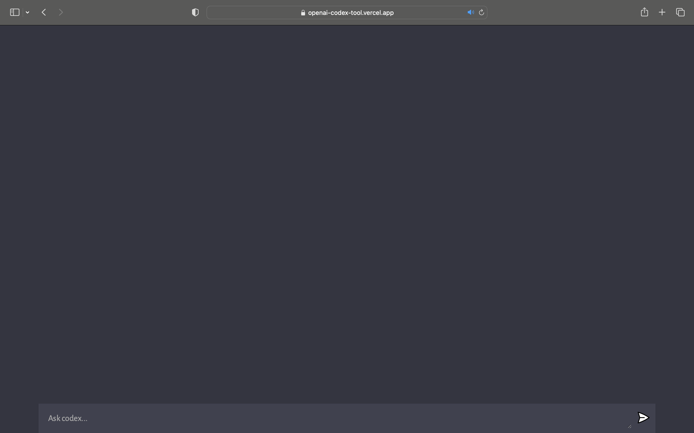

# Openai Codex Tool


## Introduction
You can ask codex anything you desire whether its coding related or something you want to figure or build just ask ... codex. The solution you always wanted as a developer right at your fingertips its free anyone can use it. Just ask codex. 
These are the folwing links related to the project:
* (Deplyed site)[https://openai-codex-tool.vercel.app/]
* (Blog Post)[https://medium.com/@mpilonmafu95/portfolio-project-blog-post-2ddfaae77844]
* (My Linkedin)[https://www.linkedin.com/in/mpilo-mafu-aaa7b6185/]
* (Codex landing Page)[https://codex-your-ai.mailchimpsites.com/]

## Installation
The folowing applies for the client only:
This is the command used to generate the client folder and the vanilla js with vite
```
npm create vite@latest client --template vanilla
```
The following applies for the server only:
This is the command used to genrate a package.json file
```
npm init -y
```
The command used to add cors, dotenv, express js, nodemon and openai to your package,json file
```
npm install cors dotenv express nodemon openai
```
## Usage
#### Client

#### Server
Before running your server, go to the package.json file which has been created following the usage above and remove the line under "scripts" and instead copy and past this line there ```"server": "nodemon server"```
Before running your server, got to the package.json file which has been created during the installation phase above add the following just above "scripts" add ```"type": "module",```.
Your package.json file should look like this:
```
{
  "name": "server",
  "version": "1.0.0",
  "description": "",
  "type": "module",
  "scripts": {
    "server": "nodemon server"
  },
  "keywords": [],
  "author": "",
  "license": "ISC",
  "dependencies": {
    "cors": "^2.8.5",
    "dotenv": "^16.0.3",
    "express": "^4.18.2",
    "nodemon": "^2.0.22",
    "openai": "^3.2.1"
  }
}
```
To check the server is fully functional use the following command:
```
npm run server
```


## Contributing
(Openai)[https://platform.openai.com/overview]

## Related Projects

## Licensing

## Deployment Tools
* Render - for the server
* Vercel - for the client
